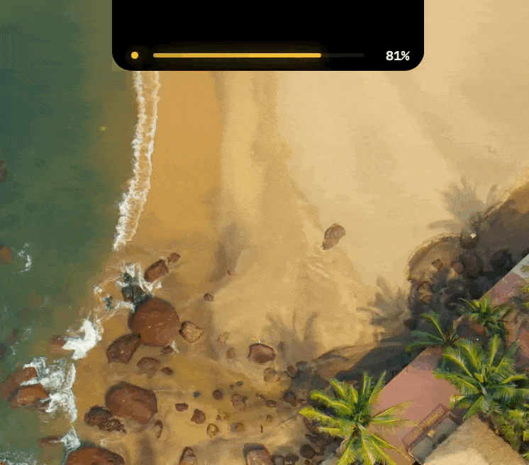
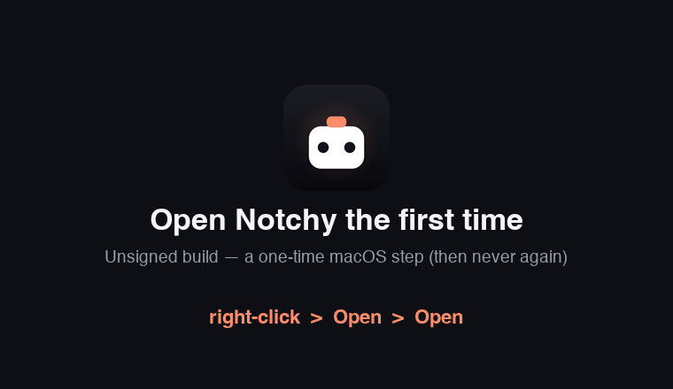

# NOTCHY

> Your MacBook notch (or menu bar), now showing your AI usage limits live — Claude, Codex, Gemini & more.

[](swift-project/NotchyLimit/LICENSE)
[](https://www.apple.com/macos/)
[](https://swift.org)
[](https://github.com/I-N-SILVA/NOTCHY/stargazers)
[](https://github.com/sponsors/I-N-SILVA)
[](https://ko-fi.com/iamnsilva)

<p align="center">
  
</p>

NOTCHY is a free, open-source macOS utility that turns the MacBook hardware notch (or the menu bar) into a real-time AI usage monitor. A minimal pill blends with the notch and shows your usage at a glance. Hover to expand into a full panel with session usage, weekly quota, time until reset, and threshold alerts. Everything runs locally with zero telemetry.

**Tracks 8 providers:** **Claude** (Claude Code / Claude.ai — real 5h + weekly), **Codex** (ChatGPT plan — real 5h + weekly), **Gemini** (Code Assist quota), **OpenAI** (API spend), **OpenRouter** (credits), **DeepSeek** (balance), **ElevenLabs** (characters), and **Perplexity**. Claude / Codex / Gemini need **no key** — Notchy reads your existing CLI login automatically.

---

## Why NOTCHY?

- **The notch is wasted real estate.** Apple uses it for the camera. macOS uses it for nothing. NOTCHY puts your most-checked number there.
- **AI limit anxiety is real.** Stop refreshing usage dashboards across Claude, ChatGPT, Gemini and friends. Your binding limit is always on screen.
- **No tab, no Electron, no 400MB.** It's a native Swift app under 10MB. Hover-to-expand like Dynamic Island.
- **Local-first, zero telemetry.** Talks only to the providers you configure. Tokens live in the Keychain / your CLI's own files. Read every line yourself.
- **Free forever.** MIT licensed. No paywalls, no upsells, no account.

---

## What it looks like

**Compact pill** sits inside the notch like a Dynamic Island element. A colour-coded glow shows your health at a glance.

**Expanded panel** drops down on hover or click. Shows your session percentage large, a rolling counter animation, session and weekly cards, and a mood-reactive retro mascot (calm, worried, then alarmed).

**Notifications** fire as in-app banners at 25, 50, 75, and 90% usage. No system permission required.

---

## Features

- **8 providers** — Claude, Codex, Gemini, OpenAI, OpenRouter, DeepSeek, ElevenLabs, Perplexity
- **No key for Claude / Codex / Gemini** — auto-detects your existing CLI login (Keychain / `~/.codex` / `~/.gemini`)
- Dynamic Island-style pill that blends with the physical hardware notch
- **Menu-bar mode** for non-notch Macs (or run both) — a clean popover listing every provider at once
- **One provider in the notch** (with its icon); switch which one from the expanded panel
- Arc progress ring + mood-reactive mascot (calm → worried → alarmed)
- Hero layout: giant usage %, reset countdown, rolling counter; session + weekly cards; credit-balance / "Active" states for providers without a quota %
- **Outage badges** — reads provider status pages and flags active incidents
- In-app banners at 25/50/75/90% — no system permission required
- 5-minute auto-refresh with exponential backoff; settings persist
- Tokens in the macOS Keychain (or your CLI's own files), never logged; local-first, zero telemetry
- Provider-extensible with a clean `UsageProvider` protocol
- MIT licensed, read every line yourself

---

## Requirements

| | Minimum |
|---|---|
| macOS | 12.0 Monterey |
| Chip | Apple Silicon (arm64) |
| Xcode CLT | Any version with Swift 5.9+ |
| Xcode (full) | Optional, only needed for Mode B |

> **Intel Mac:** Change `-target arm64-apple-macosx12.0` to `-target x86_64-apple-macosx12.0` in `scripts/build.sh`.

---

## Install

### Option A: Homebrew (recommended)

```bash
brew install --cask I-N-SILVA/notchy/notchy
```

The [cask](https://github.com/I-N-SILVA/homebrew-notchy) clears the macOS quarantine for you, so it launches with **no Gatekeeper prompt**. Update with `brew upgrade --cask notchy`.

### Option B: Download the release DMG

Grab `NotchyLimit-Installer.dmg` from the [latest release](https://github.com/I-N-SILVA/NOTCHY/releases/latest), open it, and drag **NotchyLimit** to Applications. The build is **unsigned** (no Apple Developer ID), so on first launch: **right-click the app → Open → Open**, or run `xattr -dr com.apple.quarantine /Applications/NotchyLimit.app`.

<p align="center">
  
</p>

### Option C: Build from source (no Xcode required)

```bash
xcode-select --install
git clone https://github.com/I-N-SILVA/NOTCHY.git
cd NOTCHY/swift-project/NotchyLimit
bash scripts/build.sh && open build/NotchyLimit.app
```

`build.sh` compiles with `swiftc`, assembles + ad-hoc signs the `.app`, and builds the icon — no full Xcode, no code signing, no developer account. (For development: `brew install xcodegen && xcodegen generate && open NotchyLimit.xcodeproj`.)

> Notchy is a menu-bar agent — **no Dock icon**. It lives in the notch / menu bar.

---

## First launch: connecting providers

Claude, Codex, and Gemini need **no key** — Notchy reads the login the official CLI already stored. Everything else takes an API key you paste once (kept in the Keychain, only ever sent to that provider).

| Provider | How to connect |
|---|---|
| **Claude** | Use **Claude Code** / the Claude CLI — auto-detected (`Claude Code-credentials` Keychain item or `~/.claude/credentials.json`). macOS asks once → **Always Allow**. *(No CLI? Paste a claude.ai session cookie instead.)* |
| **Codex** | `npm i -g @openai/codex` → `codex login`. Reads `~/.codex/auth.json`. |
| **Gemini** | Sign in with the `gemini` CLI (Code Assist). Reads `~/.gemini/oauth_creds.json`. *(Or paste a Gemini API key for a "Connected" status.)* |
| **OpenAI / OpenRouter / DeepSeek / ElevenLabs / Perplexity** | Paste an API key in onboarding. |

> **Note:** these use **undocumented/internal** provider endpoints that may change. If one breaks, open an [Issue](https://github.com/I-N-SILVA/NOTCHY/issues).

---

## Usage

| Action | Result |
|---|---|
| Hover over the notch pill | Expands to full panel |
| Click the pill | Pins panel open |
| Click outside the panel | Collapses to pill |
| Press Escape | Collapses to pill |
| Right-click the pill | Context menu with Refresh, Settings, Quit |

---

## Architecture

```
swift-project/NotchyLimit/Sources/
├── App/                   @main entry + AppDelegate
├── Core/
│   ├── Domain/            ProviderId, UsageWindow, ServiceUsageSnapshot, Status
│   └── State/             AppState, NotchState
├── Providers/            One folder each, all conform to UsageProvider
│   ├── UsageProvider.swift   Protocol + ProviderRegistry
│   ├── Claude/            OAuth (Keychain/file) + cookie → api.anthropic.com / claude.ai
│   ├── Codex/            ~/.codex/auth.json → chatgpt.com/backend-api/wham/usage
│   ├── Gemini/           ~/.gemini OAuth → cloudcode-pa Code Assist quota
│   ├── OpenAI/           API key → billing spend
│   ├── OpenRouter/       API key → credits
│   ├── DeepSeek/         API key → balance
│   ├── ElevenLabs/       API key → character usage
│   └── Perplexity/       API key → connected status
├── Services/              UsageService, UsageCoordinator, AuthService,
│                          NotificationService, IncidentMonitor (status pages)
├── Platform/              KeychainStore, DisplayMode, ScreenUtils, NotchDetector
└── UI/
    ├── NotchWindowController  NSPanel, hover timer, click-outside monitor
    ├── MenuBar/           NSStatusItem glyph + multi-provider popover
    ├── Compact/           Pill view
    ├── Expanded/          Full panel + provider switcher
    ├── Onboarding/        Adaptive setup (CLI-detected vs API key)
    ├── Settings/          Display toggles, notifications, providers
    ├── Diagnostics/       Sync status, raw errors
    └── Theme/             Tokens, GlassBackground, RetroMascot, StatusRingView
```

### How the notch blend works

The panel anchors at `screen.frame.maxY` (top of screen). Its height equals `safeAreaInsets.top` (the hardware notch, roughly 37pt on MBP 14/16") plus the visible content height. The top portion sits inside the physical camera housing where black blends with hardware. Only the lower portion is visible, identical to how iOS Dynamic Island works.

---

## Privacy

- Cookie stored in macOS **Keychain**, never in UserDefaults, never logged
- No telemetry, no analytics, no remote servers
- Network calls go only to the providers you configure (e.g. `api.anthropic.com`, `chatgpt.com`, `cloudcode-pa.googleapis.com`)
- MIT licensed, read every line yourself

---

## Contributing

PRs welcome. Good first issues:

- **More providers** — Grok, Mistral, Moonshot/Kimi, Groq (follow the `UsageProvider` pattern)
- **Cursor / Windsurf** — usage via browser-cookie extraction
- **Signing + notarization** — wire `scripts/sign_and_notarize.sh` once a Developer ID is available
- **Gemini → Antigravity** — migrate the Code Assist path before Google retires it (2026-06-18)
- **Intel build** — verify and document the x86_64 target
- **Sparkle auto-update** — add `Sparkle.framework` update checking

See [CONTRIBUTING.md](swift-project/NotchyLimit/CONTRIBUTING.md) for guidelines.

---

## Disclaimer

This app reads **undocumented/internal** usage endpoints of each provider. It is not affiliated with or endorsed by Anthropic, OpenAI, Google, or any provider. These endpoints may change without notice. Use at your own risk.

---

## Support the project

NOTCHY is built and maintained by one person, in the open, for free. If it saves you from refreshing `claude.ai` every ten minutes — or you just want to see the roadmap below ship faster — please consider supporting the work.

<p align="left">
  <a href="https://ko-fi.com/iamnsilva">
    
  </a>
  &nbsp;
  <a href="https://github.com/sponsors/I-N-SILVA">
    
  </a>
</p>

Every dollar goes back into the project: even more providers, code signing + notarization, Sparkle auto-update, and keeping everything free and open-source forever. See [SPONSORS.md](SPONSORS.md) for the full list of backers.

Not in a position to sponsor? **Star the repo** ⭐ — it's free and genuinely helps with discoverability.

---

## Community

- 🐛 [Report a bug](https://github.com/I-N-SILVA/NOTCHY/issues/new?template=bug_report.md)
- 💡 [Request a feature](https://github.com/I-N-SILVA/NOTCHY/issues/new?template=feature_request.md)
- 💬 [Discussions](https://github.com/I-N-SILVA/NOTCHY/discussions) — usage questions, ideas, show-and-tell
- 🐦 Follow [@iansilva](https://github.com/I-N-SILVA) for updates

---

## Star history

<a href="https://star-history.com/#I-N-SILVA/NOTCHY&Date">
  
</a>

---

## License

[MIT](swift-project/NotchyLimit/LICENSE) — Copyright 2026 Ian Silva

---

*Built by [Ian Silva](https://github.com/I-N-SILVA). If NOTCHY makes your day a little easier, [buy me a coffee](https://ko-fi.com/iamnsilva) ☕*
